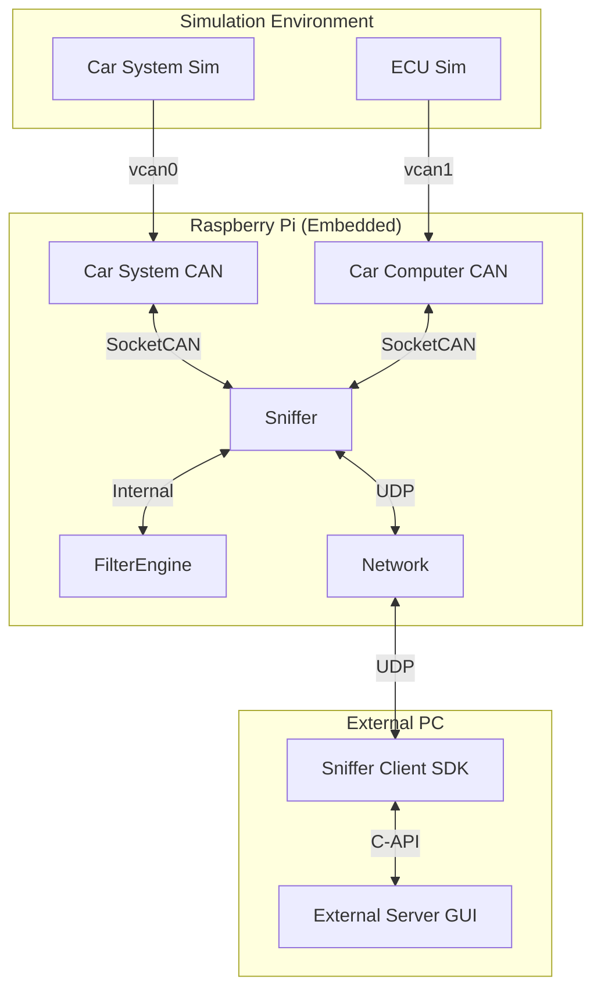

# High-Level Design (HLD) - RpiCanbusSniffer

## 1. Introduction
This document provides a detailed technical overview of the `RpiCanbusSniffer` system. It describes the software architecture, module interactions, data structures, and protocols used to achieve high-performance CAN bus monitoring and manipulation.

## 2. System Architecture

### 2.1 Block Diagram


### 2.2 Data Flow
1.  **Ingress:** CAN frames arrive at `Sniffer` via `ObdCanbusCommunication` (SocketCAN).
2.  **Processing:** Frames are passed to `FilterEngine::process`.
    *   **Lookup:** $O(1)$ access to rules for the specific CAN ID.
    *   **Logic:** Check conditions (Data Mask/Value) and Direction.
    *   **Action:** DROP (stop flow), MODIFY (change data in-place), or PASS.
3.  **Egress:** Allowed/Modified frames are sent to the opposite interface.
4.  **Logging:** If enabled, frames are wrapped in `ExternalCanfdMessage` and sent via UDP to the External Server.

## 3. Module Design

### 3.1 Core (Sniffer)
*   **`Sniffer` Class:** The main orchestrator.
    *   Manages two `ObdCanbusCommunication` instances (System, Computer).
    *   Manages one `UdpCanbusCommunication` instance (External Service).
    *   Implements `ICommunicationListener` to handle incoming CAN frames.
    *   Implements `ICommandListener` to handle UDP commands.
    *   **Watchdog:** A dedicated thread monitors the "Keep Alive" signal. If lost (>1s), it resets the system to Passthrough mode.

*   **`FilterEngine` (Static Module):**
    *   **Memory:** Uses a pre-allocated 64KB buffer (`rules_raw_memory`) to store all active rules.
    *   **Indexing:** Maintains an `id_lookup` array (pointers) and `id_counts` array for instant access to rules by CAN ID.
    *   **Concurrency:** Protected by a `std::mutex` to allow safe updates during runtime.

### 3.2 Communication Layer
*   **`ObdCanbusCommunication`:** Wraps Linux SocketCAN (`SOCK_RAW`). Handles reading/writing `struct can_frame`.
*   **`UdpCanbusCommunication`:** Wraps standard UDP sockets. Handles the `ExternalMessageV1` protocol.
    *   **Buffering:** Implements logic to handle variable-length payloads within the fixed-size protocol structure.

### 3.3 SDK (`sniffer_client`)
A C++ shared library (`.so`) providing a high-level API for external applications.
*   **`SnifferClient` Class:**
    *   **Keep-Alive:** Runs a background thread that sends `CMD_CANBUS_DATA` heartbeats if no other traffic is sent.
    *   **Queue:** Uses a thread-safe queue to store incoming log messages for the application to consume.
*   **API:** `extern "C"` functions (`client_create`, `client_send_injection`, etc.) for easy binding with Python/Java.

### 3.4 External Server (Python)
*   **Backend:** `udp_client.py` uses `ctypes` to load the SDK.
*   **Logic:**
    *   `Decoder`: Parses raw bytes into human-readable values (RPM, Speed) based on configuration.
    *   `ProfileManager`: JSON serialization for vehicle configurations.
*   **GUI:** `tkinter` based interface for visualization and control.

## 4. Protocols & Interfaces

### 4.1 UDP Protocol (`ExternalMessageV1`)
A fixed-header, variable-payload protocol designed for reliability and simplicity.

| Field | Size | Description |
| :--- | :--- | :--- |
| `magic_key` | 8 bytes | "v1.00" (Validation) |
| `command` | 4 bytes | Command ID (e.g., `CMD_SET_FILTERS`) |
| `pad` | 128 bytes | Reserved for future metadata |
| `data_size` | 4 bytes | Length of the payload |
| `data` | 64000 bytes | Payload buffer |

**Commands:**
*   `CMD_CANBUS_DATA (0x1001)`: Keep-alive / Data.
*   `CMD_CANBUS_TO_SYSTEM/CAR (0x1002/3)`: Injection.
*   `CMD_LOGGING_ON/OFF (0x1004/5)`: Control logging.
*   `CMD_SET_FILTERS (0x1006)`: Bulk rule update.
*   `CMD_SET_PARAMS (0x1007)`: Configuration update.

### 4.2 Filter Rule Structure (`CanFilterRule`)
*   `can_id` (4B): Target ID.
*   `data_index/value/mask` (1B each): Condition logic.
*   `action_type` (1B): 0=PASS, 1=DROP, 2=MODIFY.
*   `target` (1B): 0=BOTH, 1=TO_SYSTEM, 2=TO_CAR.
*   `modification_data/mask` (8B each): Bitwise modification logic.

### 4.3 Configuration File (`sniffer.prop`)
Key-Value text file loaded at startup.
```properties
car_system_can_name=vcan0
car_computer_can_name=vcan1
external_service_port=9095
```

## 5. Testing Strategy

### 5.1 Unit Tests
*   **Protocol Tests:** Verify serialization/deserialization of `ExternalMessageV1` (handling size limits, magic keys).
*   **Filter Engine Tests:** Verify logic for DROP/MODIFY rules, priority handling, and memory management.

### 5.2 Integration Tests (`emulators_integration_test.py`)
*   Runs the actual `car_system_emulator` and `car_computer_emulator` executables.
*   Uses local `vcan` interfaces.
*   Verifies that the Sniffer correctly bridges traffic and applies rules.

### 5.3 System Tests (`sniffer_client_test.py`)
*   Tests the SDK API against a running Sniffer.
*   Verifies Keep-Alive behavior, connection recovery, and high-level commands.

## 6. Design Considerations
*   **Static Allocation:** The `FilterEngine` avoids `new`/`malloc` during runtime to prevent memory fragmentation and ensure deterministic behavior.
*   **Thread Safety:** All shared resources (rules, configuration) are protected by Mutexes.
*   **Cross-Platform SDK:** The SDK is written in standard C++ with a C API, making it portable to Android (JNI), iOS, or Windows.
